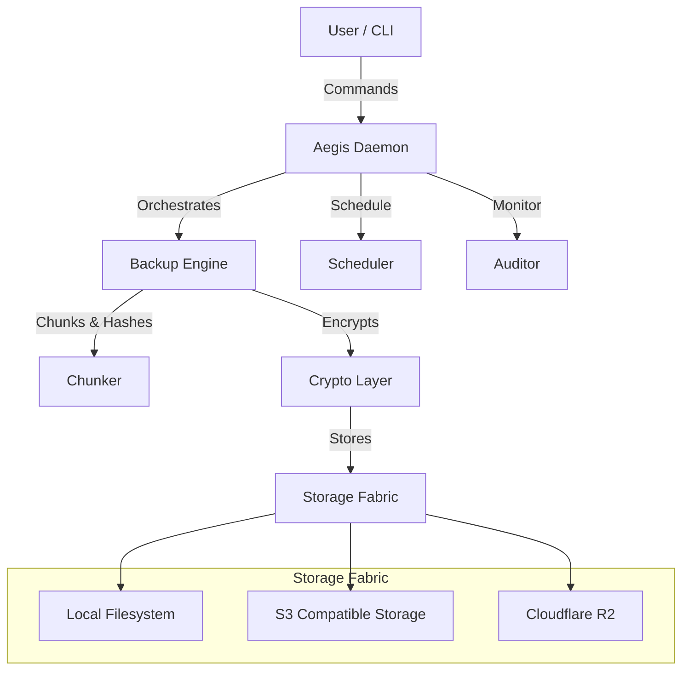

# Aegis Architecture

Aegis is designed as a secure, autonomous, and resilient backup system. Its architecture prioritizes security (Zero Trust), reliability (Self-Healing), and flexibility (Pluggable Storage).

## Core Principles

1. **Zero Trust**: Assume the storage backend is untrusted. All data is encrypted client-side before leaving the machine.
2. **Content-Addressable Storage (CAS)**: Data is deduplicated and identified by its content hash (BLAKE3/SHA256).
3. **Atomic Operations**: Backup and restore operations are designed to be atomic to prevent corruption during failures.

## System Components

### 1. The Daemon (`cmd/aegis`)

The entry point of the application. It runs as a background process, listening for configuration changes and executing scheduled jobs.

### 2. Backup Engine (`pkg/engine`)

Responsible for the core logic of taking a snapshot.

- **Scanning**: Walks the filesystem to find files.
- **Chunking**: Breaks files into variable-sized chunks (CDC - Content Defined Chunking) to maximize deduplication.
- **Indexing**: Maintains a local state DB to track changed files.

### 3. Cryptography (`pkg/crypto`)

This is the most critical component.

- **Key Derivation**: Uses Argon2id to derive encryption keys from the user's passphrase.
- **Encryption**: Uses AES-256-GCM for authenticated encryption of chunks.
- **Hashing**: Uses BLAKE3 for high-speed, secure hashing of content.

### 4. Storage Fabric (`pkg/storage`)

An abstraction layer that allows Aegis to talk to any storage backend.

- **FS**: For local backups.
- **S3**: For any S3-compatible provider (AWS, MinIO, Wasabi).

### 5. Auditor (`pkg/security`)

Runs periodically to verify the integrity of the backup repository. It catches "bit rot" or malicious tampering by re-verifying hashes and signatures.

## Data Structure

### Snapshots

A snapshot represents the state of a directory at a point in time. It is a JSON object stored in the repository, pointing to the root tree hash.

### Packfiles

To reduce API calls and overhead, small chunks are aggregated into larger "packfiles" before being uploaded to the object storage.

## Security Model

- **Confidentiality**: Ensured via AES-256 discrete chunk encryption.
- **Integrity**: Ensured via Merkle Trees and AEAD.
- **Availability**: Ensured via redundant storage options and local caching.

## Future Roadmap

- **Multi-Client Sync**: Allow multiple machines to back up to the same repo safely.
- **Compression**: Add Zstd compression before encryption.
- **GUI**: A web-based dashboard for managing backups.
